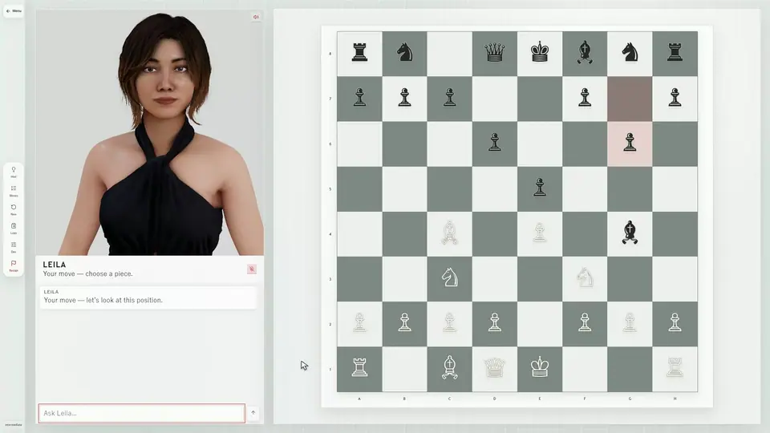

<div align="center">

# Chessbuddy

### A chess game you can talk through

An Alystria project powered by Convai. Play a position, ask why, and learn from animated AI coaches.

[Play at chessbuddy.live](https://chessbuddy.live) · [Run locally](#run-locally) · [Contribute](CONTRIBUTING.md)



[▶ Watch the full demo with sound](#watch-the-full-demo)

</div>

## Build with us

Chessbuddy is a React and TypeScript chess app with a real rules engine, Stockfish move selection, Convai dialogue and vision, and Three.js coach avatars. This repository is for developers who want to improve the game, coaching, animation, accessibility, and performance.

Good first areas: keyboard and mobile usability, chess explanations, puzzle feedback, character performance, and focused tests. Open an issue with a concrete problem before a large rewrite. See [CONTRIBUTING.md](CONTRIBUTING.md) for the workflow.

## What is here

| Area | Main files |
| --- | --- |
| Board, gameplay and UI | `src/App.tsx`, `src/ChessBoard.tsx`, `src/chessAi.ts`, `src/styles.css` |
| Coach orchestration | `src/convaiManager.ts`, `src/coachConfig.ts`, `src/coachConversation.ts` |
| Avatar and lip sync | `src/ReallusionCharacter.tsx`, `src/PortraitScene.tsx`, `src/convaiLipsyncPlayer.ts` |
| Board vision | `src/boardVision.ts` |
| Server and token exchange | `api/`, `server/index.mjs` |
| Character art used by the app | `public/`, tracked with Git LFS |
| Demo capture and editing example | `examples/demo-capture/` |

The app includes four coaches (Sofia, Leila, Magnus, and Arjun), voice and text chat, puzzles, saved games, and post-game analysis. A Convai connection enables coach conversation; the board and other local UI can be developed without putting a permanent API key in the browser.

## Watch the full demo

https://github.com/user-attachments/assets/7005bf2c-22c6-40c0-98f8-052915e4e236

Music: “Meanwhile” by Scott Buckley, [CC BY 4.0](https://creativecommons.org/licenses/by/4.0/) · [Original track](https://www.scottbuckley.com.au/library/meanwhile/).

## Run locally

Requires Node.js 22.14 or newer, npm, and Git LFS. For spoken coach responses, use a Convai account and set `CONVAI_API_KEY` in your local server environment. Never put that permanent key in a `VITE_` variable or commit it. Optional Google sign-in uses the client IDs shown in `.env.example`.

```bash
git lfs install
git lfs pull
npm ci
npm run dev
```

Open the local URL printed by Vite. The development server provides local API routes. For a production-like local run, use `npm run build` followed by `npm start` with the same server-side environment variables. `npm run check` runs the test and build gates.

The application loads optimized models from `public/`. Raw artist exports are not required to build or run this repository. Model-preparation scripts in `scripts/` are for contributors who have separate raw source assets.

## Convai integration

The browser requests short-lived Convai Connect credentials from the server; `CONVAI_API_KEY` stays server-side. Chess positions and recent moves are supplied to the coach as context, and the board can be shared through Convai Vision. The avatar renderer applies streamed facial animation to the characters in Three.js.

The vendored Convai Web SDK package is independently licensed under Apache 2.0. Follow its own terms and the Convai service terms when using it. Character assets and this app have the terms in [LICENSE](LICENSE).

## Deployment

`vercel.json` configures the Vite app and serverless routes. Set `CONVAI_API_KEY` and any server session secret in your own Vercel project. Do not reuse the production project's credentials or connect a fork to the live Chessbuddy deployment. The example deployment configuration does not grant control of chessbuddy.live.

## License

The application source and included character assets are available under the [Chessbuddy Convai Use License](LICENSE). It allows modification, contributions, and forks that continue to use Convai for AI character interaction. Because that is a use restriction, this repository is **source-available, not OSI open source**. Third-party components retain their own licenses.
